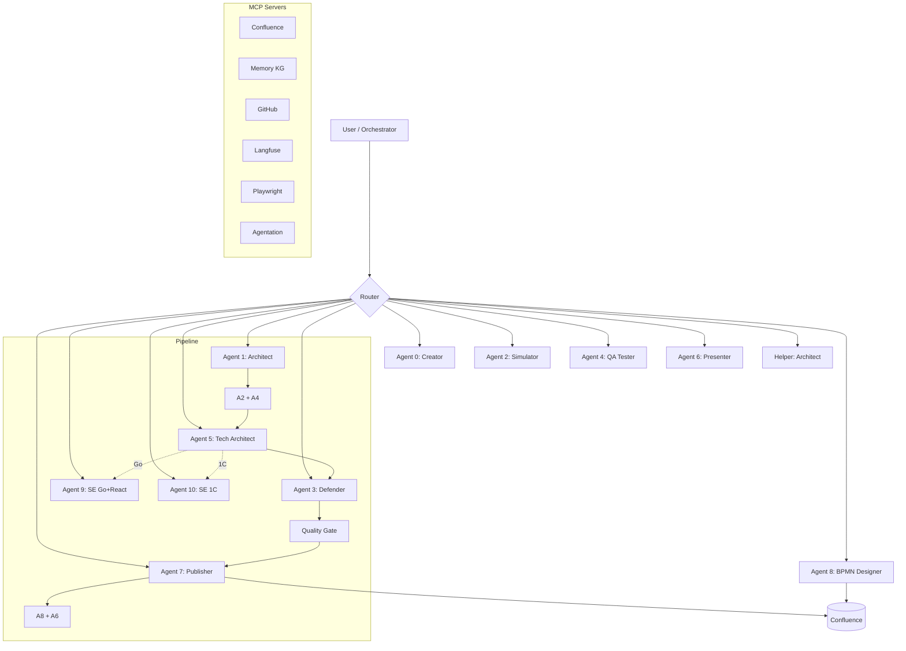

# FM Review System

Система из 12 AI-агентов для полного жизненного цикла Функциональных Моделей (ФМ) проектов 1С и Go-сервисов: создание, аудит, тестирование, публикация в Confluence.

## Prerequisites

| Tool | Version | Purpose |
|------|---------|---------|
| Python | 3.11+ | Runtime |
| Claude Code CLI | latest | Agent execution |
| jq | 1.6+ | JSON processing |
| gum | latest | Interactive TUI (scripts) |
| Infisical CLI | latest | Secrets management |
| ShellCheck | 0.9+ | Shell linting (CI) |
| Node.js | 18+ | MCP servers |

## Installation

```bash
# 1. Clone
git clone git@github.com:anthropics/fm-review-system.git
cd fm-review-system

# 2. Python deps
python3 -m venv .venv && source .venv/bin/activate
pip install -r requirements.txt

# 3. Secrets (Infisical → keyring → .env fallback)
infisical login
./scripts/check-secrets.sh --verbose

# 4. Verify
pytest tests/ -x -q
```

## Architecture



## Agents (12)

| # | Agent | Purpose | Key Command |
|---|-------|---------|-------------|
| 0 | Creator | Create FM from scratch | `/new` |
| 1 | Architect | Full audit (business + 1C) | `/audit` |
| 2 | Role Simulator | Role simulation / UX / business critique | `/simulate-all`, `/business` |
| 3 | Defender | Defend FM against stakeholder feedback | `/respond` |
| 4 | QA Tester | Generate test cases + traceability matrix | `/generate-all` |
| 5 | Tech Architect | Architecture + TZ + estimation | `/full` |
| 6 | Presenter | Presentations and reports | `/present` |
| 7 | Publisher | Manage FM in Confluence (sole writer) | `/publish` |
| 8 | BPMN Designer | BPMN diagrams in Confluence | `/bpmn` |
| 9 | SE Go+React | Code review for Go/React projects | `/review` |
| 10 | SE 1C | Code review for 1C extensions | `/review` |
| - | Helper Architect | Infrastructure: hooks, scripts, MCP, CI/CD | (orchestrator) |

Agents 9 and 10 are **conditional** — injected into pipeline based on project platform.

## Pipeline

```
Agent 1 (Audit) → [Agent 2, Agent 4] → Agent 5 → Agent 9|10 (conditional) → Agent 3 → Quality Gate → Agent 7 → [Agent 8, Agent 6]
```

Run: `python3 scripts/run_agent.py --pipeline --project PROJECT_NAME`

Options: `--parallel`, `--agents 1,2,4`, `--resume`, `--dry-run`

## Quick Start

```bash
# Interactive menu
./scripts/orchestrate.sh

# Or directly in Claude Code:
# "Run audit on PROJECT_SHPMNT_PROFIT"  → routes to Agent 1
# "Create test cases"                    → routes to Agent 4
# "Publish to Confluence"                → routes to Agent 7
```

## Key Scripts

| Script | Purpose |
|--------|---------|
| `scripts/orchestrate.sh` | Main menu (14 options) |
| `scripts/run_agent.py` | SDK pipeline runner (Claude Code SDK + Langfuse) |
| `scripts/quality_gate.sh` | FM readiness check (9 sections) |
| `scripts/gh-tasks.sh` | GitHub Issues CLI (create/start/done/block) |
| `scripts/publish_to_confluence.py` | Confluence update (v3.0, lock+backup+retry) |
| `scripts/check-secrets.sh` | Secrets verification (Infisical/keyring/.env) |
| `scripts/cost-report.sh` | Monthly cost breakdown by agent |
| `scripts/tg-report.py` | Telegram cost reports |

## Secrets

Priority: **Infisical Universal Auth** → keyring → .env (fallback)

```bash
./scripts/check-secrets.sh --verbose  # verify all keys
```

## Observability

- **Langfuse** (self-hosted v3): traces, costs, per-agent spans
- **Telegram bot**: daily cost reports (`systemd: fm-tg-bot`)
- **GitHub Issues**: task tracking with `agent:*`, `sprint:*`, `status:*` labels

## Principles

- **Speed > Control**: controls must not slow down the core business process
- **Smart controls**: auto-rules instead of manual approvals
- **Zero manual labor**: `/auto` mode, pipeline, auto-export
- **Silence = consent**: for positive deals; rejection for negative
- **Defaults for everything**: timeouts, default actions, escalations
